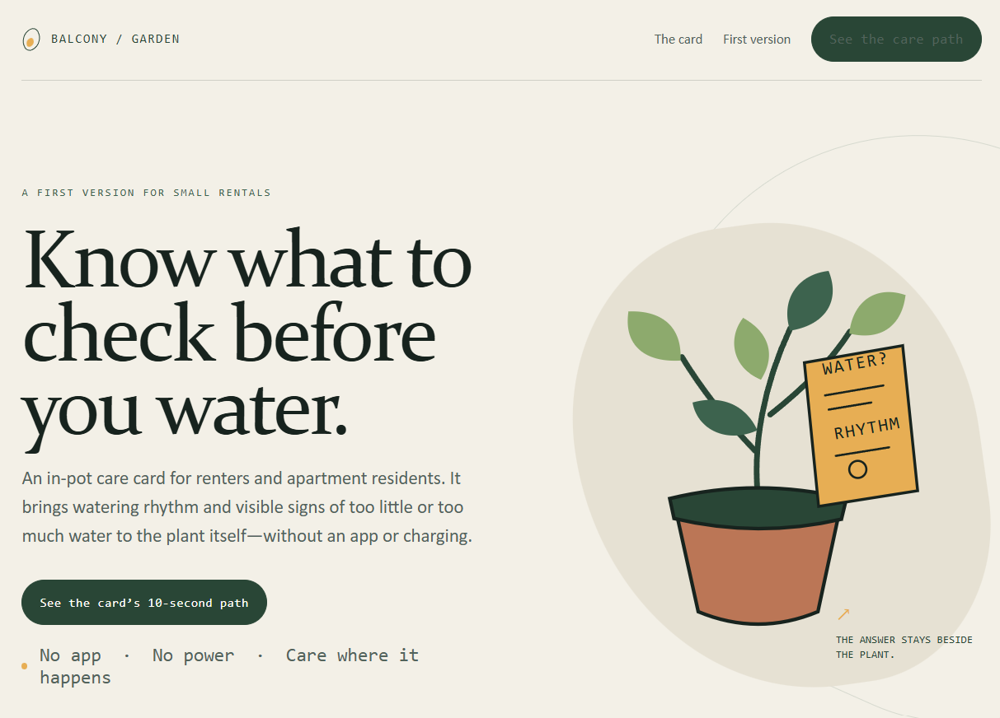
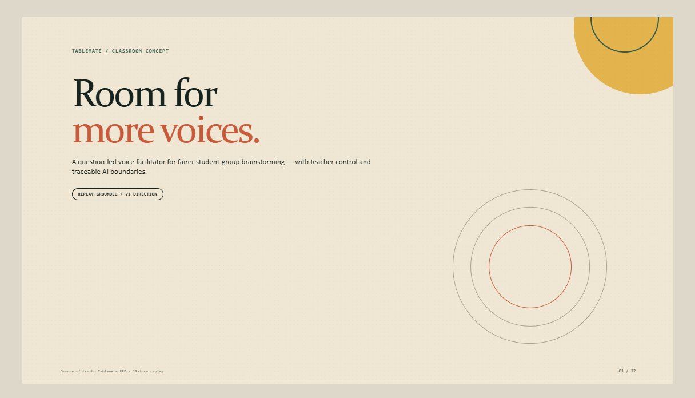
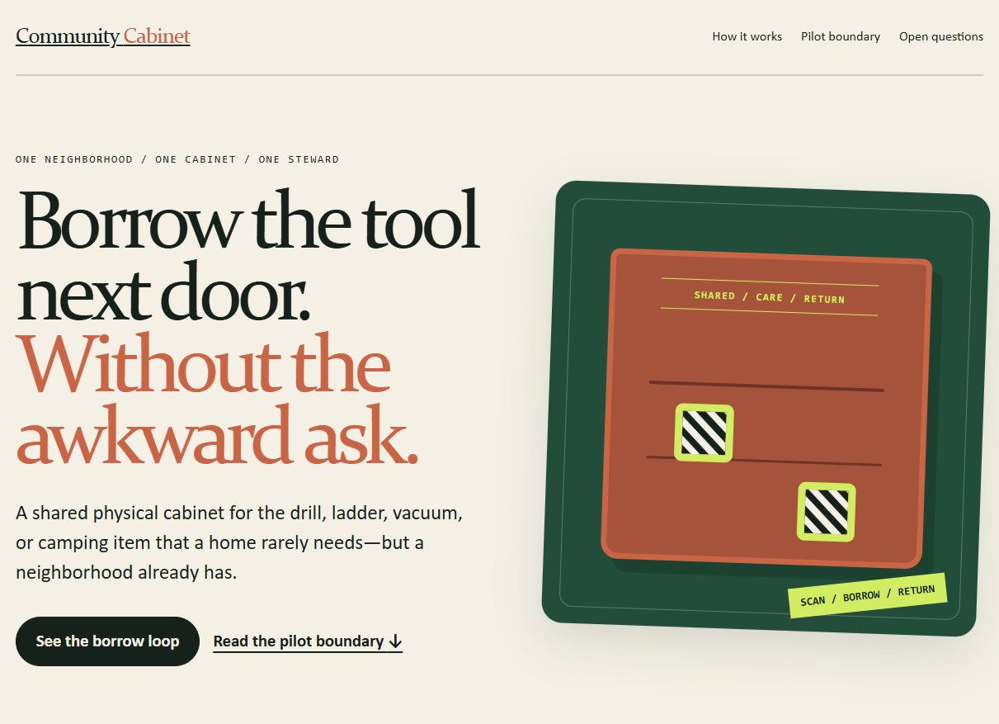

# AI Brainstorm Room — Product Skills

[English](README.md) · [Tiếng Việt](README.vi.md)

A set of agent skills for taking a rough product idea through structured brainstorming, a fact-grounded PRD, and a presentation-ready frontend artifact.

```text
Rough idea
    ↓
brainstorming — explore, shift perspective, critique, and converge while preserving provenance
    ↓
prd           — turn the group's decisions into a reviewable PRD
    ↓
frontend-design — create a landing page or pitch deck from the approved PRD
```

## Skills

| Skill | Purpose | Main inputs | Main outputs |
| --- | --- | --- | --- |
| `brainstorming` | Facilitates a multi-turn session by diagnosing which kind of thinking the group needs next | An initial idea, problem, goal, and group context | `.memlog.md`, `brainstorm-intent.md`, insights, and decisions |
| `prd` | Converts intent and trace into a reviewable PRD while separating facts, assumptions, and open questions | `brainstorm-intent.md`, `.memlog.md`, and user input | `prd.md`, with optional `addendum.md` and review artifacts |
| `frontend-design` | Creates a self-contained landing page or pitch deck with a clear design system and visual direction | An approved `prd.md` | `landing-page.html` or `deck.html` |

The rough idea is the user's starting point, not a separate skill. `brainstorming` is activated when the user wants to explore an idea across multiple turns.

## Install with skills.sh

After pushing the `skills/` directories to [Unibean9/brainstormer](https://github.com/Unibean9/brainstormer), install the full skill set:

```bash
npx skills add Unibean9/brainstormer
```

Or install individual skills:

```bash
npx skills add Unibean9/brainstormer --skill brainstorming
npx skills add Unibean9/brainstormer --skill prd
npx skills add Unibean9/brainstormer --skill frontend-design
```

Check skill discovery from the repository root:

```bash
npx skills add . --list
```

## Pipeline principles

1. `brainstorming` does not write a PRD while the group is still diverging.
2. Move to `prd` when the group has selected a direction or the user explicitly asks to finalize.
3. `prd` must not turn guesses into facts; inferred content is marked `[ASSUMPTION]`.
4. `frontend-design` reads the approved PRD and user-authorized inputs. It must not invent testimonials, metrics, features, traction, or claims.
5. The final artifacts may use one branch or both branches, but they must remain consistent with the same PRD.

## Evaluation fixtures

The [`evals/`](evals/) directory contains the golden dataset and recorded runs:

- [`golden-data.yaml`](evals/golden-data.yaml) — three end-to-end scenarios covering brainstorming, PRD creation, and landing-page or pitch-deck generation.
- [`01-balcony-garden/transcript.md`](evals/runs/01-balcony-garden/transcript.md) — the recorded conversation for the Balcony Garden scenario.
- [`01-balcony-garden/prd.md`](evals/runs/01-balcony-garden/prd.md) — its generated PRD.

Run the evaluation with:

```bash
python evals/run_eval.py
```

The evaluation set is intentionally written in English so it can be reused across agents and runtimes.

## Product context

AI Brainstorm Room is a voice facilitator for student teams and working groups. It does not default to giving the group an answer. Instead, it diagnoses whether the group needs better framing, divergence, perspective shifts, critique, or convergence, then asks a fitting question. What the group says, chooses, and explains is preserved so downstream PRDs and artifacts reflect the original reasoning.

## Showcase assets

Add screenshots from live runs to [`assets/showcase/`](assets/showcase/). The root README can display these files when they are available:







See the [showcase asset guide](assets/showcase/README.md) for filenames, dimensions, and privacy requirements.

## Repository structure

```text
.
├── README.md
├── README.vi.md
├── skills/
│   ├── brainstorming/
│   ├── prd/
│   └── frontend-design/
├── evals/
│   ├── golden-data.yaml
│   ├── run_eval.py
│   └── runs/
└── assets/showcase/
```
